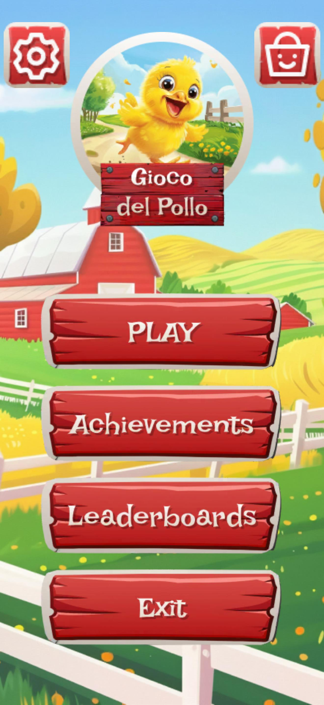
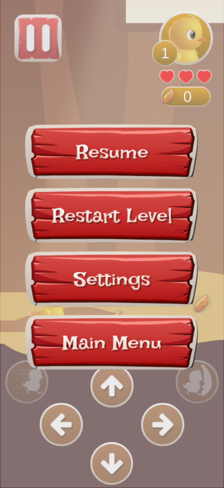
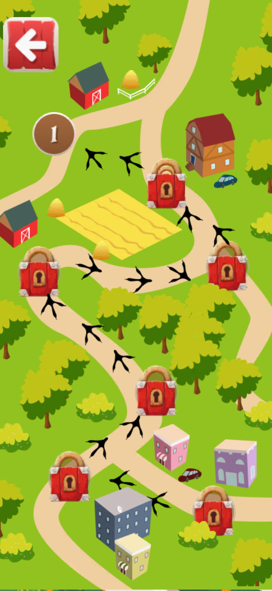
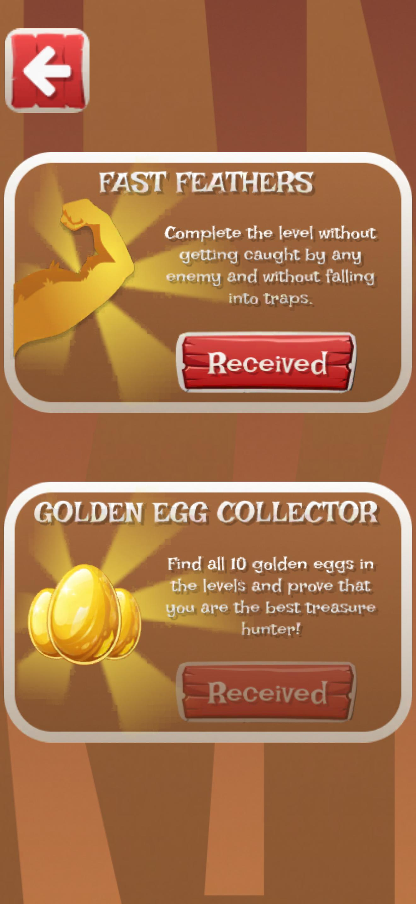
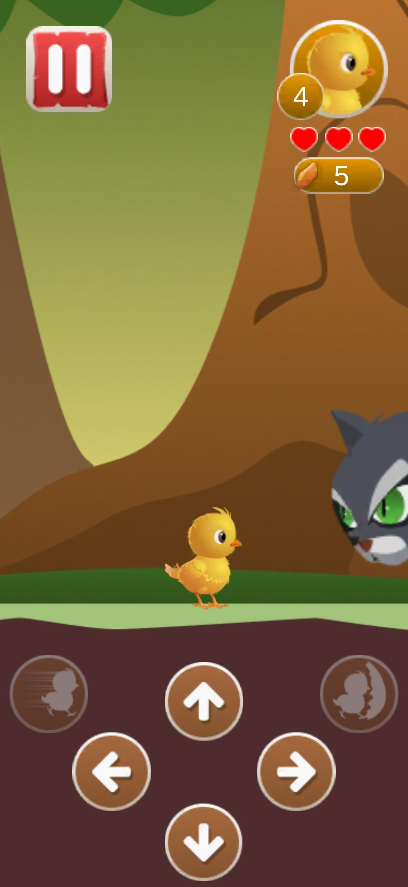

# 🐣 Gioco del Pollo Fortunato

> A mobile game where you control a brave chick dodging enemies and overcoming obstacles using arrow controls!

---

## 🎮 Play Now

▶️ [Play the game in your browser](https://arttr0.github.io/Gioco-del-pollo/)

---

## 📸 Screenshots

|  |  |  |
|-----------------------------------------|---------------------------------|-----------------------------------|
|  |  |  |

---

## 📝 Game Description

In **"Gioco del Pollo Fortunato"**, you control a chick who:

- 🐤 Runs through levels avoiding dangers  
- 🧍 Runs away from a chasing human  
- 🦊 Jumps over enemies like foxes, cats, and more  
- ⚡ Uses boosts such as **speed** and **shield**  
- 👕 Changes skins for the chick  
- 🗺️ Progresses through multiple levels with increasing difficulty

---

## 🕹️ Controls

- On-screen arrow buttons to move the chick  
- Jump, speed boosts, and other actions available through the interface

---

## 🎨 Features

- Mobile-friendly interface with easy controls  
- Multiple levels and diverse enemies  
- Animated characters and effects  
- Skins and boost systems to enhance gameplay

---

## 📁 How to Run Locally

1. Install Unity version 2022.3.5f1  
2. Clone the repository:  
   ```bash
   git clone https://github.com/arttr0/Gioco-del-pollo-fortunato.git
